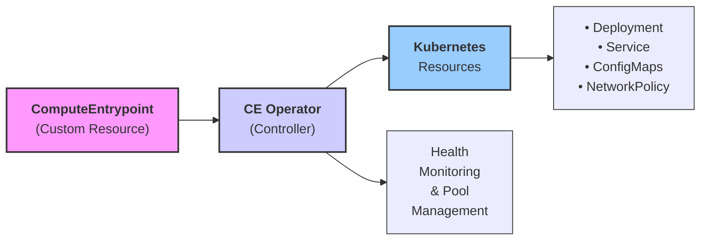

# OSG Hosted CE Kubernetes Operator

A Kubernetes operator that manages Open Science Grid (OSG) Hosted Compute Entrypoints (CEs) using custom resources. This operator automates the deployment and lifecycle management of HTCondor-CE instances that bridge OSG workloads to local compute clusters.

## Overview

The OSG Hosted CE Operator creates and manages HTCondor-CE deployments in Kubernetes that act as gateways between the OSG and local batch systems (Slurm, PBS, etc.). Each Compute Entrypoint is defined as a custom Kubernetes resource and automatically provisions all necessary components including services, network policies, and configurations.

## Features

- **Custom Resource Definition**: Declarative management of Compute Entrypoints through Kubernetes CRDs
- **Health Monitoring**: Continuous health checks with pool-aware safety mechanisms
- **Multi-Pool Support**: Track and manage resources across different OSG pools (ospool, cms, atlas, etc.)
- **Automated Configuration**: Generate HTCondor-CE, OSG-Configure, and SciTokens configurations
- **Full OSG-Configure Compliance**: Complete implementation of all OSG-Configure sections and fields
- **SciToken Integration**: User-based token mapping for VO access control
- **Network Security**: Automatic NetworkPolicy creation for secure communication
- **Load Balancing**: Service exposure with MetalLB integration
- **BOSCO Integration**: Support for SSH-based job submission to remote clusters with custom tarball URLs
- **Production/ITB Support**: Automatic configuration based on topology annotations

## Architecture


## ComputeEntrypoint Resource Specification

### Basic Structure

```yaml
apiVersion: osg-htc.org/v1
kind: ComputeEntrypoint
metadata:
  name: my-ce
  namespace: osg-ce-dev
  annotation:
    topology/facility: MyFacility
    topology/resource-group: MyFacility-Resources
    topology/resource: MyResource-CE
    topology/contact: Site Administrator
    topology/contact-email: admin@example.org
    topology/site-city: Madison
    topology/site-country: US
    topology/site-latitude: 43.0711999
    topology/site-longitude: -89.4065713
    topology/production: true
    gracc/site: MyFacility
  labels:
    pool/ospool: true
spec:
  kubernetes:
    image: hub.opensciencegrid.org/osg-htc/hosted-ce:24-release
    hostname: my-ce.example.org
    replicas: 1
  users:
  - user: osg01
    scitoken: https://scitokens.org/osg-connect
  - user: osg04
    scitoken: https://cms-auth.web.cern.ch/,bad55f4e-602c-4e8d-a5c5-bd8ffb762113
  cluster:
    host: login.example.org
    batch: slurm
    scratch: /var/lib/condor/execute/osg01
  bosco:
    dir: $HOME/bosco-osg-wn-client
    tarball: null  # Optional custom bosco tarball URL
  pilot:
  - name: standard
    queue: normal
    limit: 10
    walltime: 4320
    resources:
      cpu: 8
      ram: 16384
      gpu: 0
    vo:
    - osg
    wholeNode: false
    apptainer: false
    os: rhel8
```

### Configuration Sections

#### Metadata Annotations
Required topology and configuration annotations:
- `topology/facility`: Facility name
- `topology/resource-group`: Resource group name  
- `topology/resource`: Resource name
- `topology/contact`: Site contact name
- `topology/contact-email`: Site contact email
- `topology/site-city`: Site geographic city
- `topology/site-country`: Site country code
- `topology/site-latitude`: Site latitude coordinates
- `topology/site-longitude`: Site longitude coordinates
- `topology/production`: Production vs ITB environment (true/false)
- `gracc/site`: GRACC accounting site name

#### Kubernetes Configuration (`spec.kubernetes`)
- `image`: Container image for the HTCondor-CE
- `hostname`: External hostname for the CE
- `replicas`: Number of CE replicas (default: 1)
- `sleep`: Override container command to sleep infinity for debugging (default: false)
- `node.labels`: Node selector for pod placement
- `service.annotations`: Service annotations (e.g., MetalLB pool)

#### User Configuration (`spec.users`)
Array of SciToken to user mappings:
- `user`: Local username (e.g., osg01, osg04)
- `scitoken`: SciToken issuer URL(s), comma-separated for multiple tokens

#### Cluster Configuration (`spec.cluster`)
- `host`: Remote cluster login node
- `batch`: Batch system type (slurm, pbs, condor, etc.)
- `squid`: Squid proxy server (optional)
- `scratch`: Scratch directory path
- `ssh`: SSH configuration for BOSCO

#### BOSCO Configuration (`spec.bosco`)
- `dir`: Remote BOSCO installation directory
- `tarball`: Custom BOSCO tarball URL (optional)
- `overrides`: BOSCO configuration overrides

#### Pilot Configuration (`spec.pilot`)
Array of pilot job configurations (OSG-Configure compliant):
- `name`: Pilot configuration name
- `queue`: Target batch queue  
- `limit`: Maximum concurrent pilots (`max_pilots` in OSG-Configure)
- `walltime`: Maximum wall time in minutes (default: 1440)
- `resources`: Resource requirements
  - `cpu`: CPU core count (default: 1)
  - `ram`: Memory in MB (default: 2500)
  - `gpu`: GPU count (default: 0)
- `vo`: Supported Virtual Organizations
- `wholeNode`: Whether pilots can use entire nodes (default: false)
- `apptainer`: Require Singularity/Apptainer support (default: false)
- `os`: Operating system when apptainer=false (rhel6, rhel7, rhel8, ubuntu18)

#### Pool Labels
Use labels to assign CEs to specific OSG pools:
- `pool/ospool: true` - OSG Connect pool
- `pool/cms: true` - CMS pool  
- `pool/atlas: true` - ATLAS pool
- `pool/dune: true` - DUNE pool
- `pool/icecube: true` - IceCube pool

## Health Monitoring and Safety Features

The operator implements sophisticated health monitoring to ensure pool stability:

### Pool Health Tracking
- Monitors health percentage of resources in each pool
- Prevents updates that would violate minimum health thresholds
- Default minimum healthy percentage: 80%

### Safety Mechanisms
- Resources are only updated if pool health remains above threshold
- Temporary delays applied when health constraints would be violated
- Continuous monitoring with 60-second health check intervals

### Health States
- **Healthy**: Deployment ready and functioning
- **Degraded**: Partial availability
- **Unhealthy**: No available replicas
- **Unknown**: Health check failed
- **Missing**: Resource not found

## OSG-Configure Compliance

The operator generates fully compliant OSG-Configure configuration files following the [official OSG-Configure specification](https://github.com/opensciencegrid/osg-configure). All configuration sections are automatically generated:

### Generated Configuration Sections

#### Gateway Section
- `htcondor_gateway_enabled = True`
- `job_envvar_path=$PATH`

#### Site Information Section  
- Automatic OSG vs OSG-ITB group assignment based on `topology/production` annotation
- Complete topology information from metadata annotations
- Batch system configuration

#### Storage Section
- `grid_dir`, `worker_node_temp`: Scratch space configuration
- `app_dir`, `data_dir`: Application and data directories  
- `site_read`, `site_write`: Data staging locations

#### Gratia Accounting Section
- `enabled = True` for job accounting
- `resource`: Uses `gracc/site` annotation
- `probes = jobmanager:condor`

#### Info Services Section
- `enabled = True` for central collector reporting
- `ce_collectors`: OSG central collectors

#### Subcluster Section
- Resource specifications and VO access control
- Automatically named after topology resource

#### Pilot Sections
- Generated from `spec.pilot` configurations
- All OSG-Configure pilot fields supported
- Proper defaults per OSG specification

#### BOSCO Section
- `enabled = False` (appropriate for hosted CEs)

#### Squid Section  
- Conditional configuration based on cluster squid setting

### SciToken Configuration

The operator generates SciToken mappings from the `spec.users` section:
- Maps SciToken issuer URLs to local usernames
- Supports multiple tokens per user (comma-separated)
- Generates HTCondor ID tokens for glidein advertising
- Proper regex escaping for URL matching

### HTCondor-CE Configuration

Custom HTCondor-CE configuration can be added via `spec.config` for site-specific requirements not covered by the default generated configuration.

## Advanced Configuration

## Environment Variables

The operator supports these environment variables:

- `MIN_HEALTHY_PERCENTAGE`: Minimum pool health threshold (default: 0.8)
- `LOG_LEVEL`: Logging level (default: INFO)

### SSH Key Management

For clusters requiring SSH access, create a secret with your private key:

```bash
kubectl create secret generic my-ssh-key \
  --from-file=bosco.key=/path/to/private/key \
  -n osg-ce-dev
```

Reference it in your ComputeEntrypoint:

```yaml
spec:
  cluster:
    ssh:
      key: my-ssh-key
```

### Custom HTCondor Configuration

Add custom HTCondor-CE configuration:

```yaml
spec:
  config: |
    # Custom HTCondor-CE configuration
    SCHEDD_INTERVAL = 300
    MAX_JOBS_PER_OWNER = 100
```

### BOSCO Configuration

Configure BOSCO-specific settings:

```yaml
spec:
  bosco:
    dir: $HOME/bosco-osg-wn-client
    tarball: https://example.com/custom-bosco.tar.gz  # Optional custom tarball
    overrides:
    - name: gridmanager.log.debug
      path: /path/to/custom/config
```

The `tarball` field allows specifying a custom BOSCO tarball URL for installation on the remote login host instead of using the default determined by the Hosted CE.

## Monitoring and Troubleshooting

### Check Operator Status
```bash
kubectl logs -n osg-ce-dev deployment/osg-hosted-ce-controller
```

### Monitor ComputeEntrypoint Status
```bash
kubectl describe computeentrypoint my-ce -n osg-ce-dev
```

### Debug CE Container
```bash
kubectl exec -it deployment/osg-hosted-ce-my-ce -n osg-ce-dev -- bash
```
